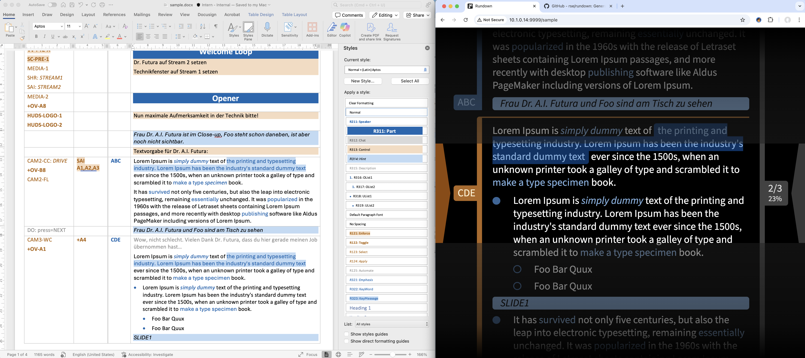

Rundown
=======

**Generate Rundown Scripts for Teleprompting**

[](https://github.com/rse)
[](https://github.com/rse)
[](https://github.com/rse/rundown)
<br/>
[](https://npmjs.com/@rse/rundown)
[](https://npmjs.com/@rse/rundown)
[](https://npmjs.com/@rse/rundown)

Abstract
--------

`rundown`(1) is a small tool to generate *rundown scripts* for
teleprompting. It can read *Microsoft Word* format files (`*.docx`),
extract table text from it, and generate HTML output for use in a
browser based teleprompting scenario.



Installation
------------

```
$ npm install -g @rse/rundown
```

Usage
-----

The [Unix manual page](https://github.com/rse/rundown/blob/master/cli/rundown.md) contain
detailed usage information.

Example
--------

```
$ rundown -o sample.html sample.docx
```

Design Criterias
----------------

- Allow director plan preparation to be done in a fully *collabortively edited* Word document
- Keep table-format in Word-based director plan

- Consistently use Word *styles* in director plan for unambiguous semantics and conversion 
- Support all *necessary markups* from the years of experience at msg Filmstudio
- Distinguish between control and content (teams) in director plan

- Allow directory plan to be *automatically* converted into the teleprompter view
- Intentionally do *not support any editing* of the teleprompter view
- Allow teleprompter view to be *updated within a minute*, even during dry-runs and just before going live

- Use light-mode in director plan to support printing
- Use dark-mode in teleprompter view to avoid outshine effects on cameras
- Align light-mode directory plan and dark-mode teleprompter view as close as possible
- Use strong typographic conventions in both directory plan and teleprompter view

- Always show an active speaker indicator in teleprompter view
- Always show a progress indicator in teleprompter view
- Support view size adjustments in teleprompter view
- Ensure that lines do not become too wide in teleprompter views to avoid too much wandering of the eyes

Architecture
------------

- [rundown-lib: base functionality](rundown-lib/)
- [rundown-cli: command-line interface](rundown-cli/)
- [rundown-gui: graphical user interface](rundown-gui/)
- [rundown-app: native application](rundown-app/)

License
-------

Copyright &copy; 2023-2024 Dr. Ralf S. Engelschall (http://engelschall.com/)<br/>
Licensed under [GPL 3.0](https://spdx.org/licenses/GPL-3.0-only)

