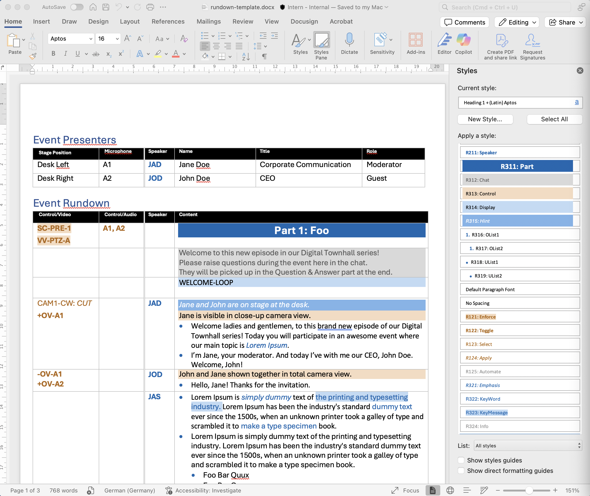
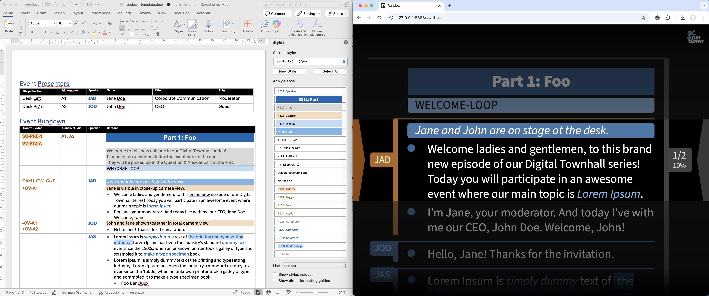

Rundown
=======

**Render Rundown Scripts for Teleprompting**

[](https://github.com/rse)
[](https://github.com/rse)
[](https://github.com/rse/rundown)

Abstract
--------

**Rundown** is a toolkit for rendering *rundown scripts* for
teleprompting. It reads a *Microsoft Word* format file (`*.docx`) as
its "single source of truth", extracts columns of a particular table
from it, and renders typographically strong and smooth scrolling HTML
output for use in a browser-based teleprompting scenario. It consists
of a library, providing the base functionality, and both a command-line
interface and Web user interface for driving the functionality. The
teleprompting view can be ad-hoc in batch, continuously in batch, or
interactively rendered.

Impressions
-----------

The following is the rundown script input in Microsoft Word:



The following is a side-by-side view of the Microsoft Word rundown
script input on the left, and the rendered teleprompter view on the
right:



The following is the rendered prompting view in the original 16:9 aspect ratio,
as shown in the studio on the teleprompters:


The following are two screenshots of the interactive web user interface,
showing the buttons to download and upload the rundown script, and the
supported keystrokes for controlling the scrolling of the rendered
teleprompter view:


Installation
------------

```
$ git clone https://github.com/rse/rundown
$ npm install
$ npm start build
```

Usage
-----

- **CMD** Mode (One-Shot Conversion)

    ```
    # with Rundown source tree
    $ npm run rundown -o      rundown-doc/rundown-template.html  rundown-doc/rundown-template.docx
    $ npm run rundown -o - - >rundown-doc/rundown-template.html <rundown-doc/rundown-template.docx

    # with Rundown archive distribution
    $ rundown-cli -o      rundown-template.html  rundown-template.docx
    $ rundown-cli -o - - >rundown-template.html <rundown-template.docx

    # with Rundown Docker distribution
    $ docker run -v .:/work engelschall/rundown -o     /work/rundown-template.html /work/rundown-template.docx
    $ docker run -i         engelschall/rundown -o - -      >rundown-template.html      <rundown-template.docx
    ```

- **WEB** Mode (Continuous Conversion)

    ```
    # with Rundown source tree
    $ npm run rundown -v info -a 127.0.0.1 -p 8888 -m web ./rundown-doc

    # with Rundown archive distribution
    $ rundown-cli -v info -a 127.0.0.1 -p 8888 -m web .

    # with Rundown Docker distribution
    $ docker run -p 8888:8888 -v .:/work engelschall/rundown -v info -p 8888 -m web /work
    ```

- **WEB-UI** Mode (Interactive Conversion)

    ```
    # with Rundown source tree
    $ npm run rundown -v info -a 127.0.0.1 -p 8888 -m web-ui

    # with Rundown archive distribution
    $ rundown-cli -v info -a 127.0.0.1 -p 8888 -m web-ui

    # with Rundown Docker distribution
    $ docker run -p 8888:8888 engelschall/rundown -v info -o 8888 -m web-ui
    ```

Design Criterias
----------------

The design of **Rundown** strictly followed the following particular design criterias, driven by
the experiences and demands in the *msg Filmstudio* of Dr. Ralf S. Engelschall:

- **Input**:
    - **Collaborative Input Editing**:
      Allow rundown script preparation to be done in a fully
      *collabortively edited* Microsoft Word document.
    - **Table-Based Input**:
      Keep table format in Word-based rundown script, people are already used to.
    - **Style-Based Input**:
      Consistently use Microsoft Word *styles* in rundown script for
      unambiguous semantics and conversion.
    - **Experience-Driven Markups**:
      Support all *necessary markups* from the years of event experience.
    - **Distinguished Control & Content**:
      Distinguish between control (left side of table) and content
      (right side of table) in rundown script.

- **Output**:
    - **Auto-Conversion**:
      Allow rundown script to be *automatically* (within a minute)
      converted into the rendered teleprompter view.
    - **Single Source of Truth**:
      Intentionally do *not support any editing* of the rendered
      teleprompter view, as the single source of truth is the Microsoft Word document.
    - **Incremental Rendering Updates**:
      Allow rendered teleprompter view to be *incrementally updated*,
      especially during event dry-runs and optionally also just before going
      live in events.

- **Style**:
    - **Light Input**:
      Use light-mode in Microsoft Word based rundown script to also support printing.
    - **Dark Output**:
      Use dark-mode in rendered teleprompter view to avoid outshine effects on cameras.
    - **Aligned Input/Output**:
      Optically align light-mode rundown script and dark-mode
      teleprompter view as close as possible.
    - **Strong Typography**:
      Use strong typographic conventions in both rundown script and teleprompter view.

- **Rendering**:
    - **Speaker Indicators**:
      Always show an active speaker indicator in teleprompter view, so
      that, at any time, one knows who is currently speaking.
    - **Progress Indicators**:
      Always show a progress indicator in teleprompter view,
      so that, at any time, one knows where one is within the event.
    - **Text Size Adjustment**:
      Support text size adjustments in teleprompter view within reasonable ranges only.
    - **Reduced Eye Wandering**:
      Ensure that lines do not become too wide in teleprompter views,
      to avoid too much wandering of the eyes.
    - **Smooth Scrolling**:
      Support very smooth scrolling in the teleprompter view.
    - **Dial Controller Support**:
      Support dial controller (Prompter People Shuttle Pro) for controlling the scrolling.
    - **Presenter Preflights**:
      Allow presenters to in-advance preflight their prompting session.
    - **Confidential Preflights**:
      Support fully local preflights for confidential rundown script content.

Architecture
------------

The **Rundown** toolkit consists of the following parts:

- [rundown-doc: input documents](rundown-doc/)
- [rundown-lib: rendering library](rundown-lib/)
- [rundown-cli: command-line interface](rundown-cli/)
- [rundown-web: web interface](rundown-web/)
- [rundown-dst: distribution assembly line](rundown-dst/)

Those parts form an architecture which allows various use cases:


License
-------

Copyright &copy; 2023-2025 Dr. Ralf S. Engelschall (http://engelschall.com/)<br/>
Licensed under [GPL 3.0](https://spdx.org/licenses/GPL-3.0-only)

