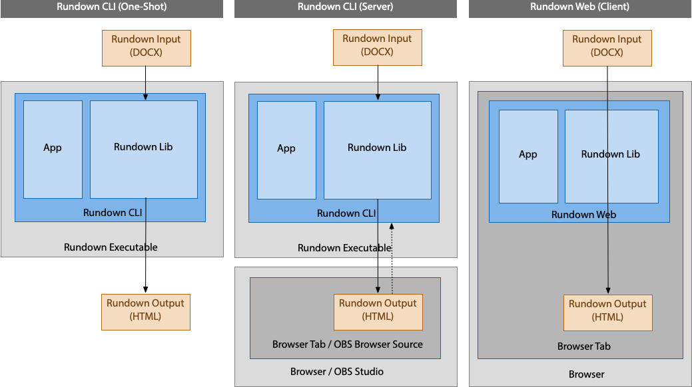

Rundown
=======

**Render Rundown Scripts for Teleprompting**

[](https://github.com/rse)
[](https://github.com/rse)
[](https://github.com/rse/rundown)

Abstract
--------

**Rundown** is a toolkit for rendering *rundown scripts* for
teleprompting. It reads a *Microsoft Word* format file (`*.docx`),
extracts a particular table from it, and renders HTML output for use in
a browser-based teleprompting scenario. It consists of a library, providing
the base functionality, and both a command-line interface and Web user interface
for driving the functionality.


Installation
------------

```
$ git clone https://github.com/rse/rundown
$ npm install
$ npm start build
```

Usage
-----

- Rundown CLI (One-Shot)

    ```
    $ rundown -o etc/sample.html etc/sample.docx
    ```

- Rundown CLI (Server)

    ```
    $ rundown -a 127.0.0.1 -p 8888 ./etc
    $ open http://127.0.0.1:8888
    ```

- Rundown Web

    ```
    $ npx serve -l 8888 rundown-web/dst/
    $ open http://127.0.0.1:8888
    ```

Design Criterias
----------------

The design of **Rundown** strictly followed the following particular design criterias, driven by
the experiences and demands in the *msg Filmstudio* of Dr. Ralf S. Engelschall:

- Teaming:
    - Allow director plan preparation to be done in a fully
      *collabortively edited* Microsoft Word document.
    - Keep table format in Word-based director plan, people are already used to.

- Markup:
    - Consistently use Microsoft Word *styles* in director plan for
      unambiguous semantics and conversion.
    - Support all *necessary markups* from the years of event experience.
    - Distinguish between control (left side of table) and content
     (right side of table) in director plan.

- Output:
    - Allow directory plan to be *automatically* (within a minute)
      converted into the rendered teleprompter view.
    - Intentionally do *not support any editing* of the rendered
      teleprompter view, as the single source of truth is the Microsoft Word document.
    - Allow rendered teleprompter view to be *incrementally updated*,
      especially during event dry-runs and optionally also just before going
      live in events.

- Theming:
    - Use light-mode in Microsoft Word based director plan to also support printing.
    - Use dark-mode in rendered teleprompter view to avoid outshine effects on cameras.
    - Optically align light-mode directory plan and dark-mode
      teleprompter view as close as possible.
    - Use strong typographic conventions in both directory plan and teleprompter view.

- Rendering:
    - Always show an active speaker indicator in teleprompter view, so
      that, at any time, one knows who is currently speaking.
    - Always show a progress indicator in teleprompter view,
      so that, at any time, one knows where one is within the event.
    - Support text size adjustments in teleprompter view within reasonable ranges only.
    - Ensure that lines do not become too wide in teleprompter views,
      to avoid too much wandering of the eyes.

Architecture
------------

- [rundown-lib: base functionality](rundown-lib/)
- [rundown-cli: command-line interface](rundown-cli/)
- [rundown-web: web interface](rundown-web/)
- [rundown-gui: graphical user interface](rundown-gui/) (unfinished)
- [rundown-app: native application](rundown-app/) (unfinished)



License
-------

Copyright &copy; 2023-2025 Dr. Ralf S. Engelschall (http://engelschall.com/)<br/>
Licensed under [GPL 3.0](https://spdx.org/licenses/GPL-3.0-only)

